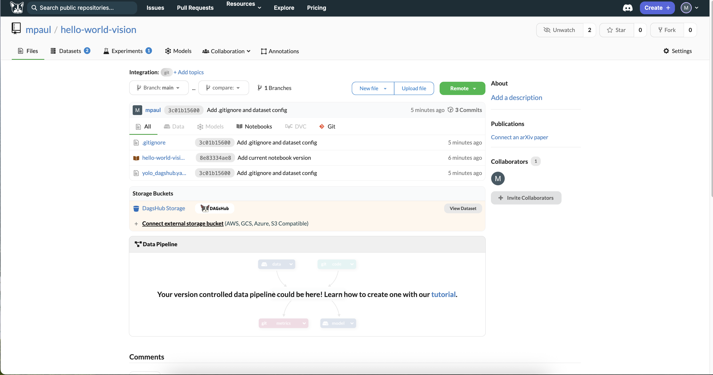
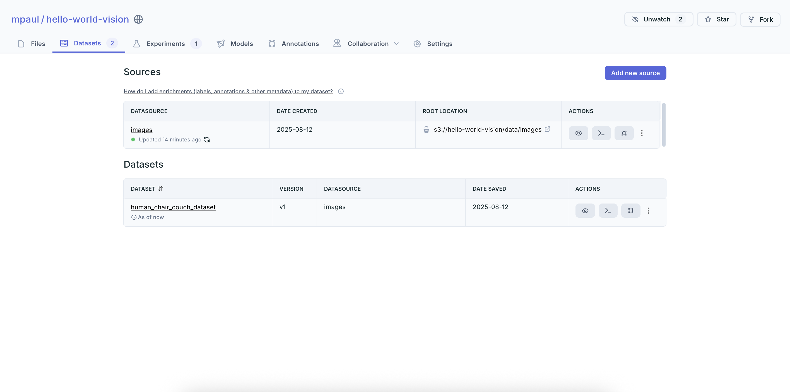
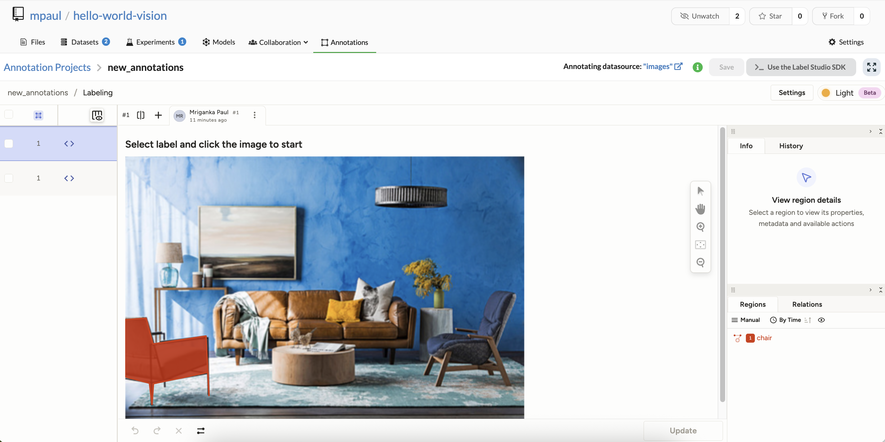
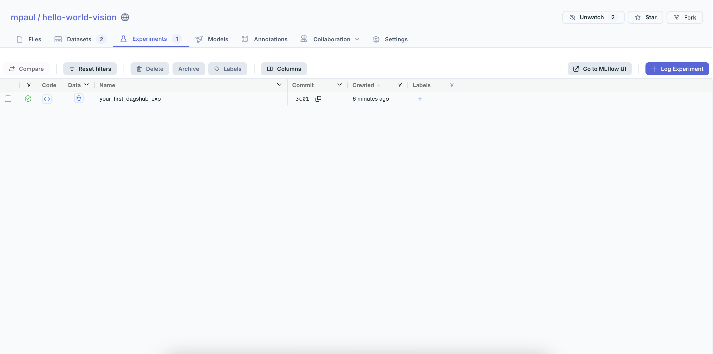
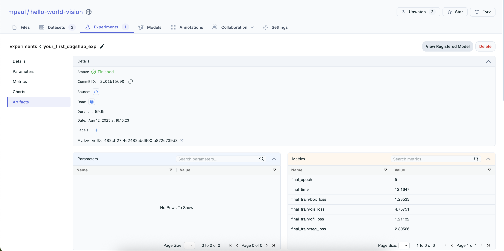
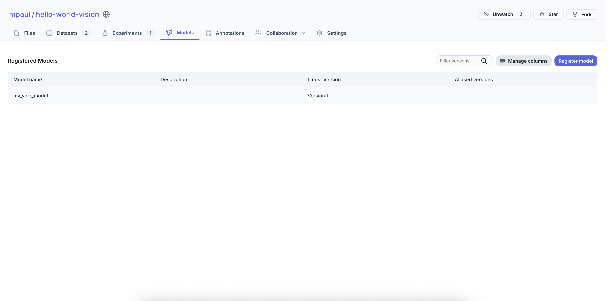

# DagsHub

DagsHub is an open-source-based MLOps platform for managing and collaborating on machine learning projects. Provides unified data versioning, experiment tracking, model management, and team collaboration. Specializes in multimodal AI data (vision, audio) with integrated annotation capabilities.

## Project

## Raw and Labelled Data

## Labelling Process

## Experiments

## Experiment Tracking

## Models

